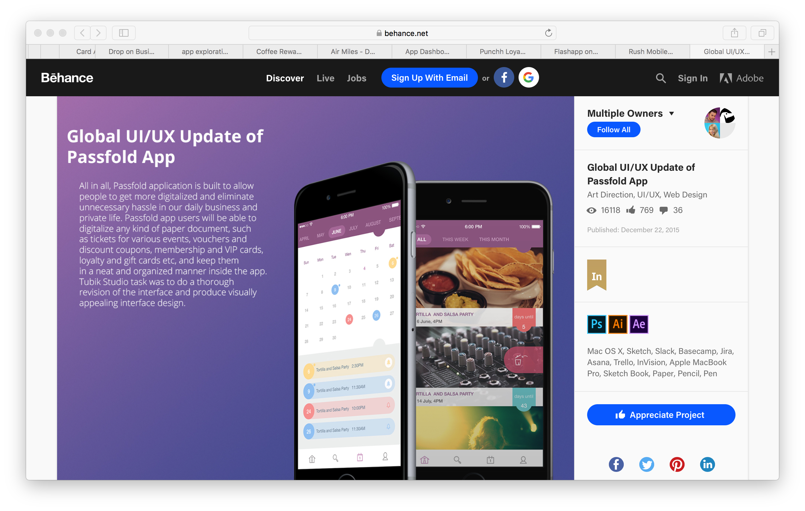

# Inspirations
## Why?
> Save and organize creative ideas during a project, or even permanently, in order to have access to them very quickly and let ideas ‘simmer’ for a while. ~ HAN University of Applied Sciences - Amsterdam University of Applied Sciences (z.d.)

## How?
I will collect inspiration from multiple platforms like [behance](https://www.behance.net), [dribbble](https://dribbble.com) & [pinterest](http://pinterest.com/).

## Results

> https://dribbble.com/shots/3156743-Loyalty-Card-Animation

> https://dribbble.com/shots/3154625-Drop-on-Business-Insider

> https://dribbble.com/shots/3659785-Loyalty-app-exploration

> https://dribbble.com/shots/3266968-Coffee-Rewards-Loyalty-App

> https://dribbble.com/shots/3221635-Air-Miles-Dutch-Loyalty-Programme

> https://dribbble.com/shots/1308183-Loyalty-App-Dashboard

> https://www.behance.net/gallery/40881521/Punchh-Loyalty-App

> https://www.behance.net/gallery/54832093/Flashapp

> https://www.behance.net/gallery/55872535/Rush-Mobile-App

> https://www.behance.net/gallery/29598419/Global-UIUX-Update-of-Passfold-App
