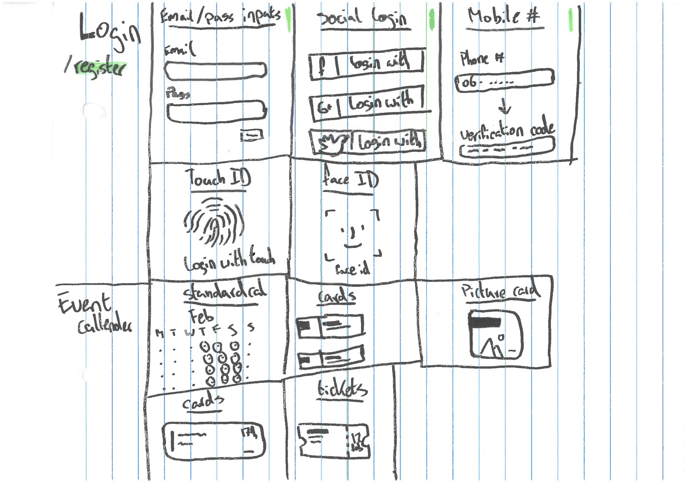
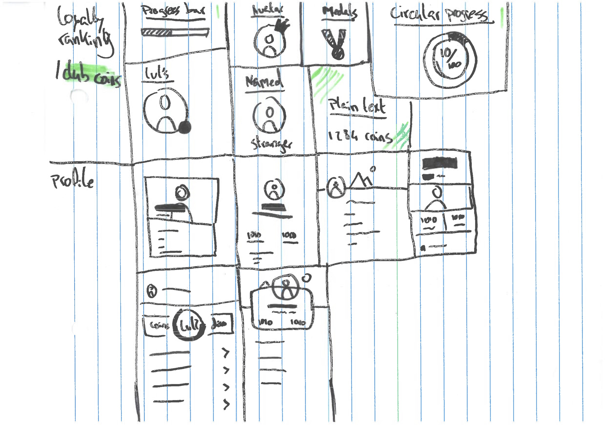
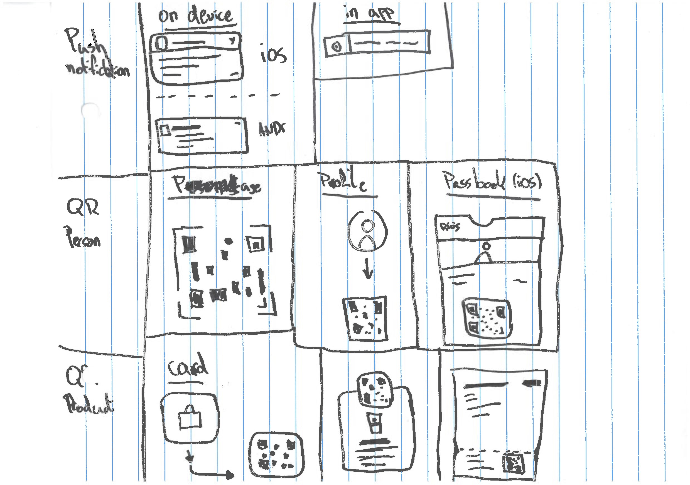

# Morphological Chart
## Why?
> Generating ideas in a systematic manner. ~ HAN University of Applied Sciences - Amsterdam University of Applied Sciences (z.d.)

I'm composing a chart to generate all possible variants of my core functionalities.
- Login/ Register
- Event Callender
- Loyalty Ranking/ Club Coins
- Profile
- Push Notifications
- QR Personal code
- QR Product code

## Conclusion
The research resulted in the following:

The images above can also be viewed in [pdf format](https://iancstewart.gitbooks.io/graduation-project-productbiografie/content/assets/downloads/morphological-chart.pdf).
