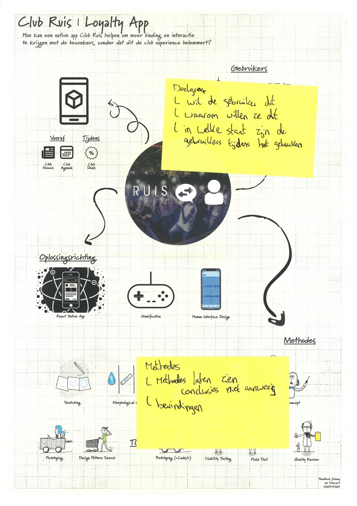

# Feedback frenzy
The feedback frenzy is a moment meant to collect feedback from a bigger group then you normally meet in. Your work is showcased in the form of a poster. After the feedback session i collected all of the given feedback.

## Received feedback
*place the feedback notes per person over here*

> The raw forms can be viewed in [pdf format](https://iancstewart.gitbooks.io/graduation-project-productbiografie/content/assets/downloads/feedback-frenzy-forms.pdf).

## Important notes
After reading all received feedback I stuck some post'its with the most important notes on the poster.

