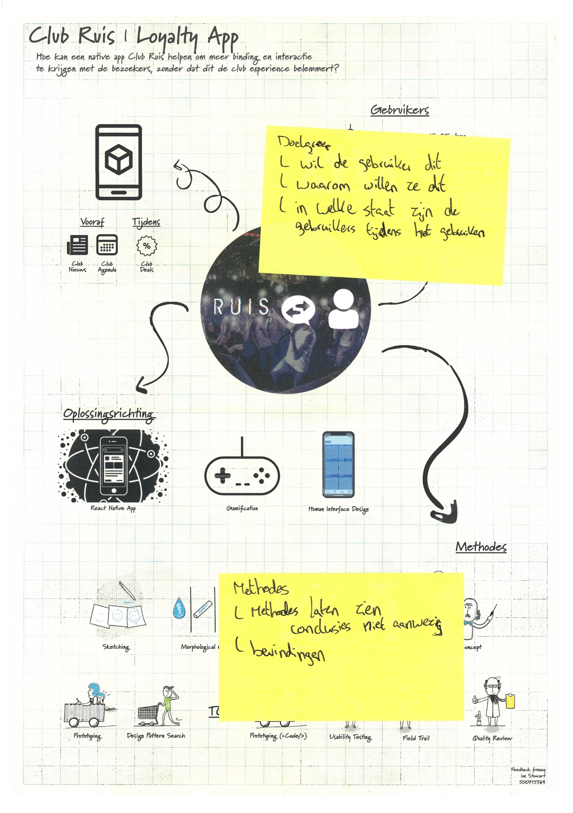

# Feedback Frenzy

The feedback frenzy is a moment meant to collect feedback from a bigger group then you normally meet in. Your work is showcased in the form of a poster. After the feedback session i collected all of the given feedback.

## Received feedback

### Feedback van Sjef

* Waar reageren gebruikers ter plekke op?
* Wat brengt gebruikersertoe om de app te gebruiken in Club Ruis?
* Bestellen via app?
* Invloed op muziek keuze?
* Challanges?

### Feedback van Eva

* Waarom is het een probleem?
* Dit kan echt een success worden als het echt iets toevoegd voor de feestgangers
* Misschien zijn de gebruikers te dronken om de oplossing te willen gebruiken?

### Feedback van Pablo

* Wat is "interactie"
* Gaat dit het het oplossen?
* Nice prototype
* Onderzoeks methodes & conclusies kunnen uitgebreider

### Feedback van Harold

* Ik weet dat je op de achtergrond wel een verhaal hebt maar je brengt 't hier niet helder over.
* Je hebt een opdrachtgever die een app wil. Lat dat ook zien.

### Feedback van Niels

* Is hier behoefte aan?
* Wat is precies het probleem?
* Willen mensen een app instaleren voor een club?

### Feedback van Kelvin

* Wat is er onderzocht?
* Wat is het probleem?
* De oplossing is duidelijk, maar wat het moet oplossen niet.

### Feedback van Aranea

* Erg lastig om goed feedback op te geven. Ik mis de kern van je verhaal.

### Feedback van Willem

* Misschien iets meer gericht

### Feedback van Yvette

* Waarom willlen ze dit verbeteren? Alleen vannuit ruis of ook de bezoekers?
* Methodes weergegeven, maar geen conclusies of waarom je hiervoor kiest. Wat zijn de eisen?
* Uitzoeken of de gebruikers hier echt behoefte aan hebben of zullen gebruiken.

### Feedback van Floor

* Wil de doelgroep dit ook echt/ is er behoefte aan en waarom is dit een probleem.
* Methodes misschien uitgebreider laten zien + conclusies?

> The raw forms can be viewed in [pdf format](https://iancstewart.gitbooks.io/graduation-project-productbiografie/content/assets/downloads/feedback-frenzy-forms.pdf).

## Important notes

After reading all received feedback I stuck some post'its with the most important notes on the poster.

