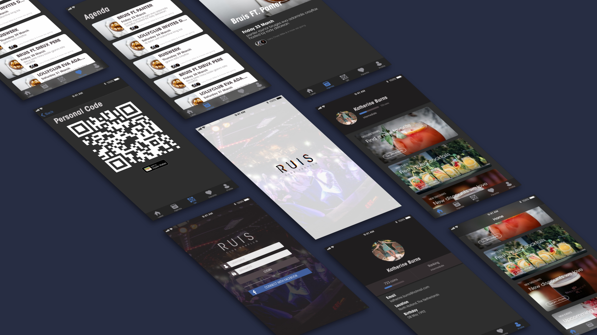

# HiFi Prototype v1
## Why?
> Develop, evaluate or communicate a concept or design.  ~ HAN University of Applied Sciences - Amsterdam University of Applied Sciences (z.d.)

I'm creating a digital representation of my sketches to be able to do usability testing on a more visual level. After this process I hope to have a better understanding if the sketches are as usable as i expected.

## How?
I will convert my sketches into a visual design using [Sketch](https://www.sketchapp.com). During this process I will try to best follow the [Human Interface Guidelines (HIG)](https://developer.apple.com/design/human-interface-guidelines/ios/overview/themes/).

## Result

This resulted in a digital representation of all screens that would be in the app. With this result I will be able to do further usability testing to refine and improve this current design.

The complete set of screens can be viewed in [pdf format](../assets/downloads/hifi-v1.pdf)
