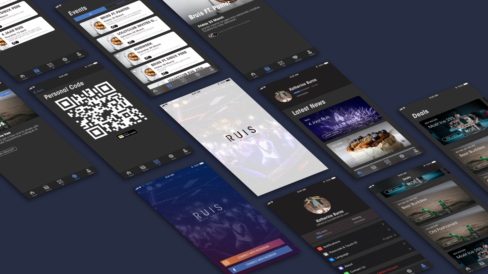

# HiFi Prototype v1
## Why?
> Develop, evaluate or communicate a concept or design.  ~ HAN University of Applied Sciences - Amsterdam University of Applied Sciences (z.d.)

I'm adjusting my first digital design to improve on usability and visual design. After this process i hope to have alleviated the found usability problems and will have improved upon the visual design.

## How?
I will convert the results of my usability test into a better visual design, whilst still using [Sketch](https://www.sketchapp.com). Again during this process I will try to best follow the [Human Interface Guidelines (HIG)](https://developer.apple.com/design/human-interface-guidelines/ios/overview/themes/).

## Result

This resulted in a further iterations upon my initial design. The process impacted almost every screen that was in v1 making them more visually appealing and have a better usability.

The complete set of screens can be viewed in [pdf format](../assets/downloads/hifi-v2.pdf)

---

> The design and Sketch prototype can be found at [Sketch.cloud](https://sketch.cloud/s/5xWvE)
