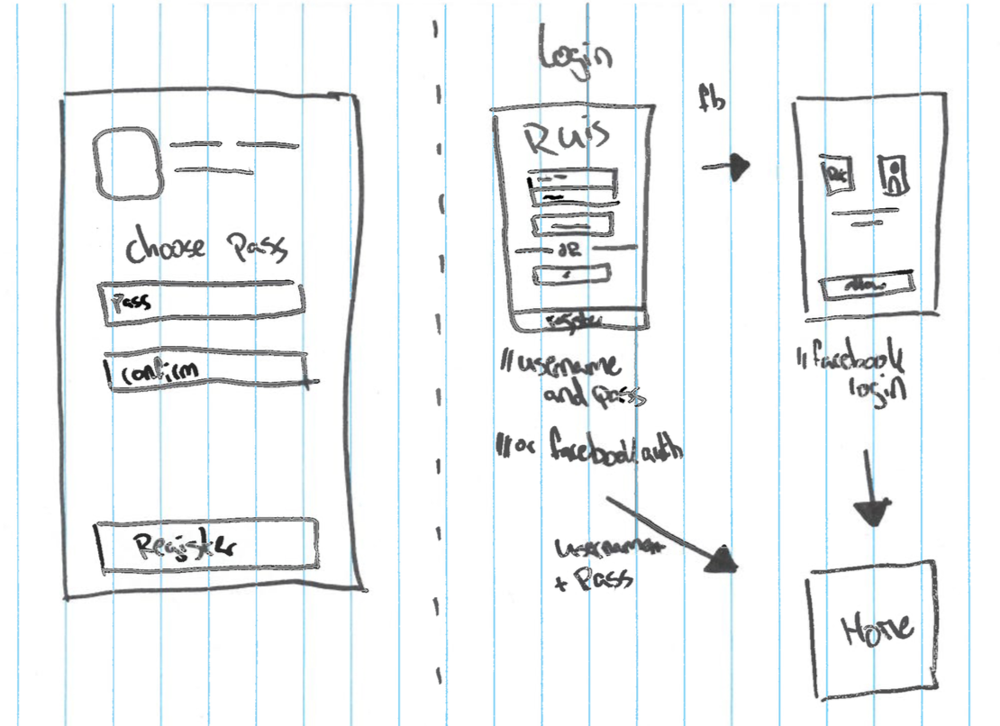

# Sketch Dump
## Why?
> Explore and communicate forms and ideas. ~ HAN University of Applied Sciences - Amsterdam University of Applied Sciences (z.d.)

This sketch dump was to clear my head of initial ideas. It's a first look at the flow and screens needed for this app.

## How?
I'll take a pen and a piece of paper and draw down my initial ideas. The resulting sketches will be used to discuss and develop more ideas and directions together with colleagues and stakeholders.

## Result
After converting my ideas to sketches the following dump occured:

The complete document can be viewed in [pdf format](https://iancstewart.gitbooks.io/graduation-project-productbiografie/content/assets/downloads/sketch-dump.pdf).
