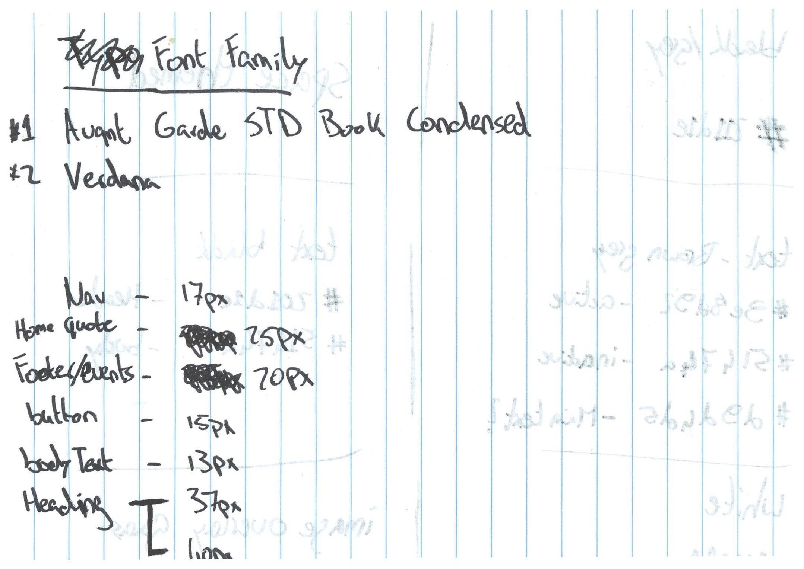
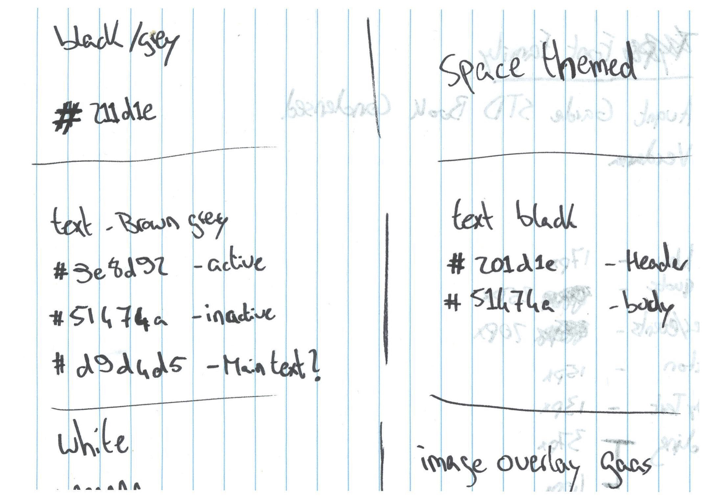
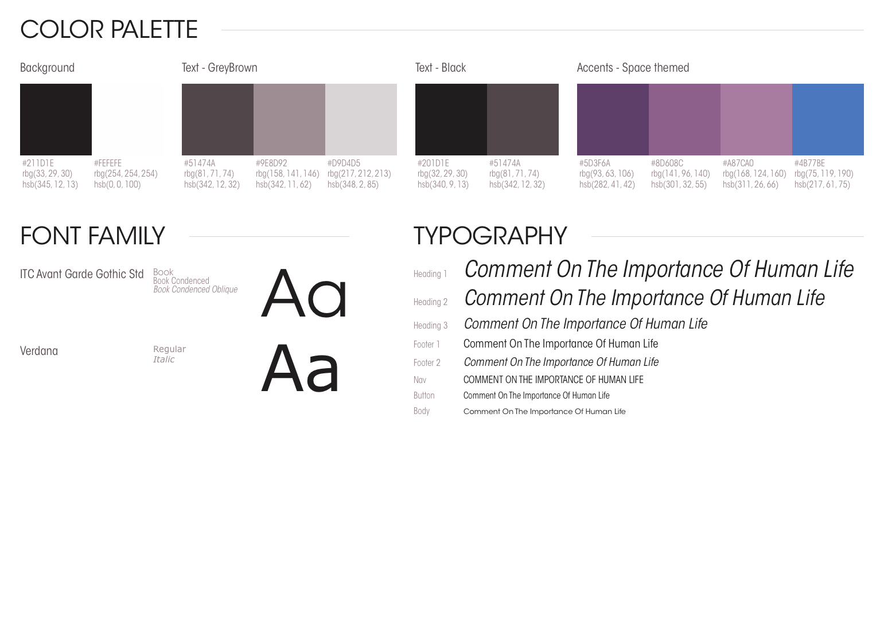

# Styleguide
## Why?
I'm making a styleguide to make sure the design stays consistent and follows the current style of the club. By creating this file I will get a better understanding of the current style and will be better at applying it throughout the HiFi design.

## How?
By researching the current style and appearance of the site and the fysical ckub itself I will be able to create a styleguide file. This file will contain information about the colors, the fonts and the typography that will be used.

## Results
After researching the site and the club itself, the following derived:

### Sketches
I started of by a rough sketch of what would become the styleguide. Below the sketches which derived from the research:

### Digital Styleguide
After i finished up on the sketches i translated this to a visual and readable styleguide.

