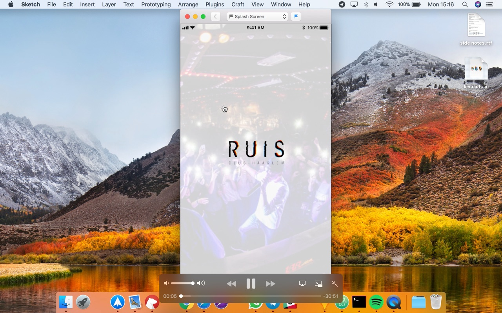

# Usability Test
## Why?
> Detect problems users have with your design and correct these before the product goes live. ~ HAN University of Applied Sciences - Amsterdam University of Applied Sciences (z.d.)

After designing the first version of the HiFi prototype I will be doing a usability test to uncover issues with the current design. By testing this current design I will be able to iterate on this version and create a user friendlier v2.

## How?
I will test the Sketch prototype by doing expert reviews. During these reviews I will let them use the prototype while I watch how they use the app. After they used the prototype for a while I will interview them about what they experienced. This way i hope to uncover the usability problems that these users have.

## Result
### Jip Blom | 26 March

### Dimitri de Wit | 17 April
1. Waarom moet je m’n geboorte datum weten? Die app op jouw telefoon is toch al genoeg bewijs?
2. Eerste scherm na inlog leek beetje op iemand anders profiel ipv dat van m’n eigen.. dunno why
3. QR, ik dacht dat ik hier dingen kon scannen juist, maar ik zie alleen m’n eigen QR? Die moet dan in de club gescand worden als ik een drankje haal? Misschien moet hier uitleg bij of zo?
4. Onboarding vond ik wat onduidelijk, wat kan ik precies met de app? extra uitleg mss hier of daar?’
5. Wat doet de apple wallet? *stukje n00b van mij, wat voegt dat ding toe? wat kan je er uberhaupt mee lol*
6. Hoe ga je zorgen dat mensen iedere keer hun pokkie erbij hebben met die QR? Je wilt dus de gebruikers bezoek verbinden aan deze app, hoe ga je dat doen? Enkel de incentive van ‘korting’ lijkt me nie genoeg?

### Martijn Bevelander | 18 April
1. Home: komt nu niet echt goed uit de verf. Duidelijk 3 verschillende items tonen (Nieuws over club, Nieuwe drankjes, Nieuwe deals)
2. Mis in welke app ik zit (Ruis branding/ Ruis feel in de app zetten?)
3. Agenda en Favorites lijken dubbel (favorites verwerken in agenda)
4. Agenda hernoemen naar events?
5. Push notifications los trekken van liked events (gebruiker een fysieke toggle voor ‘remind me’ geven)
6. Profile: Settings for local notifications
7. Mist een first time app sign-in (Laat de gebruiker zien hoe de app gebruikt moet worden)

### Sjaak Luthart | 23 April
1. Ik mis een soort start up guide. Wat doet de app; Hoe werkt de app; Hoe gebruik ik de app;
2. Agenda en Favorites: Deze paginas zijn het zelfde? Het verschill is lastig te zien misschien deze combineren
3. Profiel pagina voelt als een lege pagina; Misschien iets van settings hier verwerken.
4. Inloggen: Wat als ik geen facebook heb? Steeds meer mensen stappen van Facebook af;
5. Waar vind ik  de deals? Moeilijk om te vinden als ze ergens in de news feed staan;
6. Naming voor de ranking is misschien wat standaard?

### Juri Beenen | 25 April
1. Ruis huistyle is aanwezig maar mis de ruis branding; (logo's bijv.)
2. Agenda kan beter events heten.
3. Mist een onboarding tutorial
4. Favorites kan een dubbeling worden van agenda als ik alles like; Deze paginas combineren?
5. Wat doet apple wallet (Android gebruiker)
6. De deals zijn erg goed verstopt; Deze een losse pagina geven? (Dit is uiteindelijk waar de app om draait)

## Conclusion
After doing the expert usability tests I found the following points to adjust in the design/ prototype:

1. Add a onboarding tutorial after first sign up
2. Combine Favorites and Agenda into one page
3. Rename Agenda to Events
4. Make Profile page more useful
5. Sing-in/ Register; Have multiple social media platforms as choice
6. Move deals to separate page
7. Add Ruis Branding
