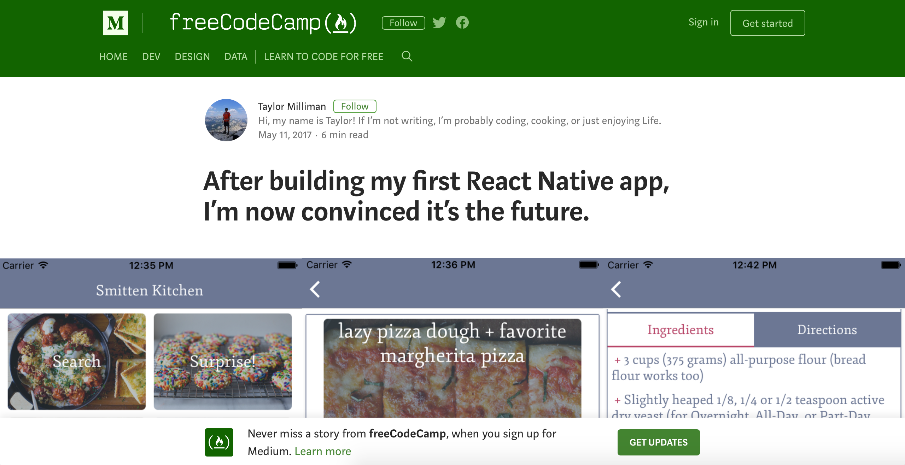

# Read Articles
## Why?
During the process of my graduation project I will be reading up on some articles. These articles will be about matters needed for my project. By reading these articles i hope to get a better understanding of what ever I'm researching at that time.

## How?
I will be reading post on sites like [Medium.com](https://medium.com). To make notes while i read I will print the articles on 45% scale. This gives me a good amount of white space to make notes about what I'm reading.

## Results
### [How We Built Our React Native App](https://medium.com/engineering-housing/how-we-built-our-react-native-app-3380a33811ac)

> This article was read on the 21st of February | The full document with notes can be read in [pdf format](https://iancstewart.gitbooks.io/graduation-project-productbiografie/content/assets/downloads/article-.pdf).

### [Prototyping inside Sketch 49 — Learn how it works and what you can do 🔥🎉🚀](https://medium.com/sketch-app-sources/prototyping-inside-sketch-49-how-it-works-and-what-you-can-do-7a48c829f282)

This article was read on the 5th of March | The full document with notes can be read in [pdf format](https://iancstewart.gitbooks.io/graduation-project-productbiografie/content/assets/downloads/article-.pdf).

### [Top 9 UI Design Trends for Mobile Apps in 2018](https://medium.muz.li/top-9-ui-design-trends-for-mobile-apps-in-2018-14b4fa350d3a)

This article was read on the 5th of March | The full document with notes can be read in [pdf format](https://iancstewart.gitbooks.io/graduation-project-productbiografie/content/assets/downloads/article-.pdf).

### [Platform guidelines matter and you should follow them](https://medium.com/dashlane-insights/platform-guidelines-matter-and-you-should-follow-them-30c85bf59aa1)

This article was read on the 7th of March | The full document with notes can be read in [pdf format](https://iancstewart.gitbooks.io/graduation-project-productbiografie/content/assets/downloads/article-.pdf).

### [After building my first React Native app, I’m now convinced it’s the future.](https://medium.freecodecamp.org/after-building-my-first-react-native-app-im-now-convinced-it-s-the-future-d3c5e74f8fa8)

This article was read on the 19th of March | The full document with notes can be read in [pdf format](https://iancstewart.gitbooks.io/graduation-project-productbiografie/content/assets/downloads/article-.pdf).

### [Gamification in UX. Increasing User Engagement.](https://uxplanet.org/gamification-in-ux-increasing-user-engagement-6437cbf702aa)

This article was read on the 23rd of March | The full document with notes can be read in [pdf format](https://iancstewart.gitbooks.io/graduation-project-productbiografie/content/assets/downloads/article-.pdf).

### [Here’s everything I’ve learned from designing 10,000+ UI screens as a lead product designer.](https://medium.com/ux-power-tools/heres-everything-i-ve-learned-from-designing-10-000-ui-screens-as-a-lead-product-designer-7d2810bee810)

This article was read on the 13th of April | The full document with notes can be read in [pdf format](https://iancstewart.gitbooks.io/graduation-project-productbiografie/content/assets/downloads/article-.pdf).

### [7 Reasons Why React Native Is the Right Choice for Mobile App Development](https://medium.com/app-affairs/7-reasons-why-react-native-is-the-right-choice-for-mobile-app-development-605e80c75865)

This article was read on the 23rd of April | The full document with notes can be read in [pdf format](https://iancstewart.gitbooks.io/graduation-project-productbiografie/content/assets/downloads/article-.pdf).

### [React Native - The Good, the Bad and the Ugly](https://medium.com/widgetlabs/react-native-and-the-good-the-bad-and-the-ugly-f10b5baf703e)

This article was read on the 23rd of April | The full document with notes can be read in [pdf format](https://iancstewart.gitbooks.io/graduation-project-productbiografie/content/assets/downloads/article-.pdf).
