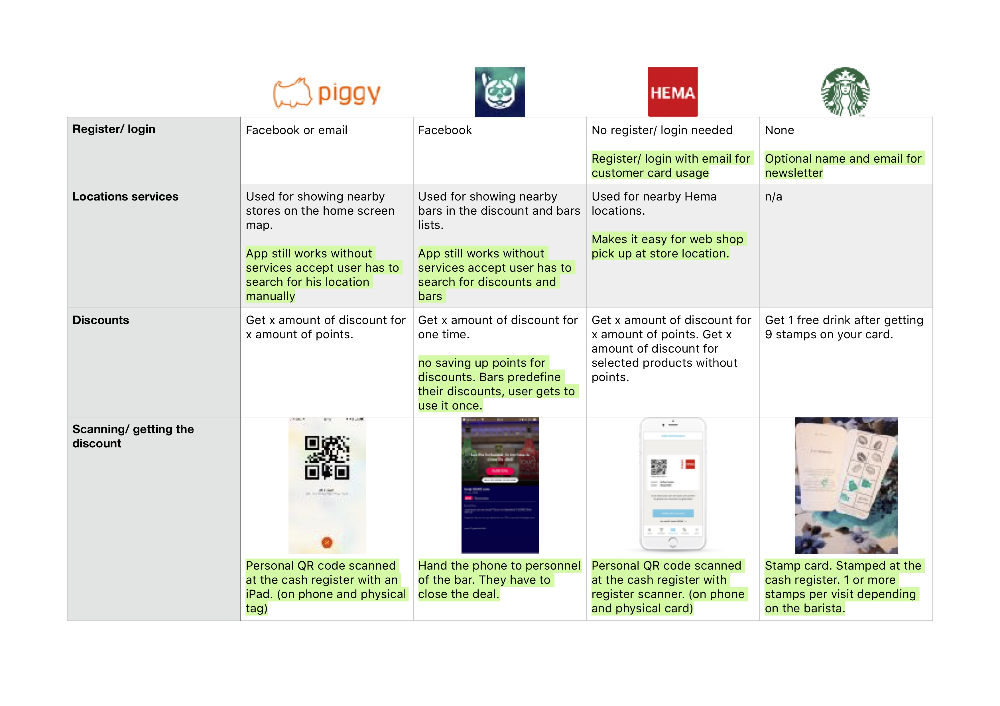
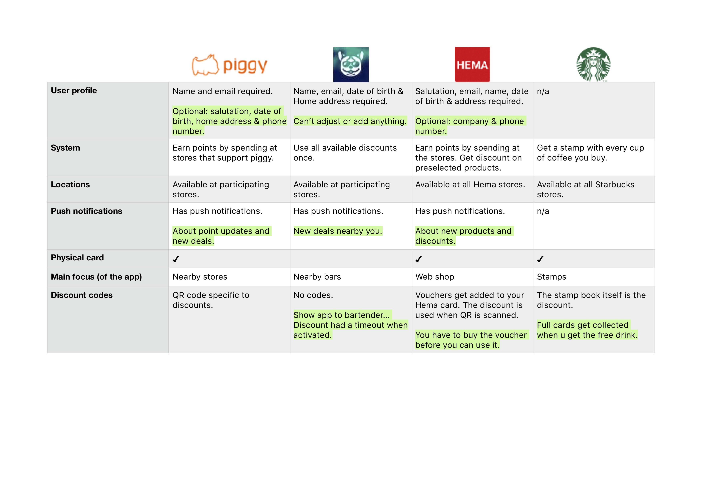

# Competitive analysis
## Why?
> Find a niche or unique selling point competitors are not filling. ~ HAN University of Applied Sciences - Amsterdam University of Applied Sciences (z.d.)

I'm researching the competitors to get a better understanding of what features are know within this specific realm. After this research I would like the following:
- Who are the competitors
- What core features do these competitors have
- What are these features/ what are these features used for
- Benefits/ caveats for these features

## How?
I will use desk research to compose a table of competitors and their main features. The table will be filled with information about this features in the corresponding app. I will determine the benefits and/ or caveats to be able to build a clear understanding where to head from here.

## Results
The research resulted in the following graph:

## Conclusion
### Main competitors
After the desk research I found the following 'big name' competitors:
- Piggy
- BarDoggy
- Hema
- Starbucks

### Features
Most of these apps have the following features:
- Register/ Login
- Location services
- Discounts
- Scanning/ getting the discounts
- User profile
- Push notifications

The images above show a more detailed illustration of these conclusions. The composed table can also be viewed in [pdf format](https://iancstewart.gitbooks.io/graduation-project-productbiografie/content/assets/downloads/comparison-chart.pdf).
