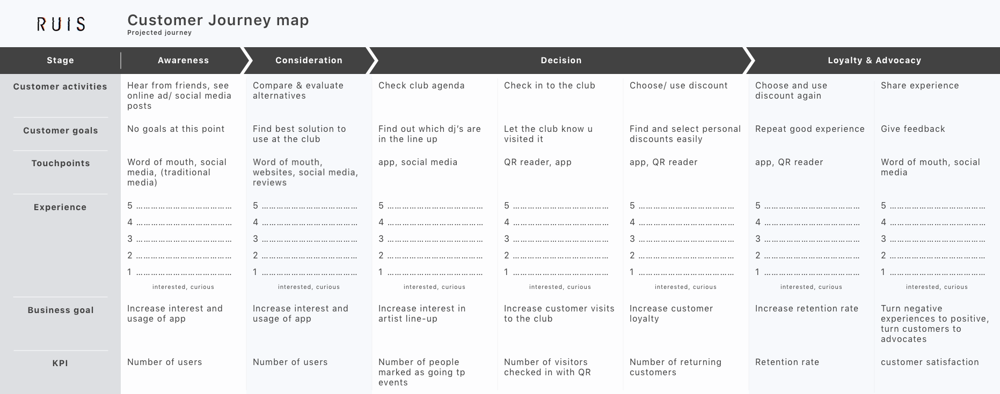

# Customer Journey Map

## Why?

> Visualize the user experience of a service over time and across the different interaction moments \(touch points\) within the service. ~ HAN University of Applied Sciences - Amsterdam University of Applied Sciences \(z.d.\)

I'm visualizing the wanted experience of the app to get a better understanding of the wanted flow and touch points.

## How?

I will use desk research to compose a journey map which will then visualize the wanted flow and touch points

## Results

The research resulted in the following journey:

